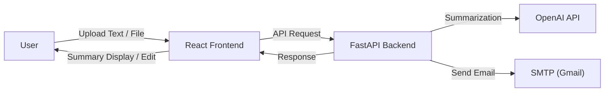

# AI Meeting Notes Summarizer

This is a full-stack app that uses AI to create short summaries from meeting transcripts and documents. You can upload files, paste text, add your own instructions, edit the summary, and email it out.

<p align="center">
  
  
  
  
  
</p>

## Live Demo

Try it out [here](https://ai-summarizer-nine-brown.vercel.app).

## Application Preview


## Features

- **AI-Powered Summarization**: Get clear and accurate summaries using OpenAI.
- **Custom Instructions**: Tell the AI what to focus on or what tone to use.
- **Multiple Input Options**: Paste text directly or upload .txt files.
- **Editable Output**: Check and tweak the summary before you share it.
- **Email Integration**: Send summaries to one or more people easily.
- **Rate Limiting**: Keeps things under control to avoid overuse and extra costs.

## Tech Stack

| Category    | Technology                  |
|-------------|-----------------------------|
| Backend     | Python 3.11+, FastAPI, Uvicorn |
| Frontend    | React.js, Axios, CSS        |
| AI & Email  | OpenAI API, FastAPI-Mail, SlowAPI |
| Deployment  | Vercel (Frontend), Render (Backend) |

## Architecture



## Local Setup & Installation

### Prerequisites

- Node.js v18 or higher
- Python v3.11 or higher
- An OpenAI API key
- A Gmail account with a Google App Password (for email sending)

### 1. Clone the Repository

```bash
git clone https://github.com/adarshnair04/ai-summarizer.git
cd ai-summarizer
```

### 2. Backend Setup

Navigate to the server directory:

```bash
cd server
```

Create and activate a virtual environment:

```bash
python -m venv venv
source venv/bin/activate  # On Windows: venv\Scripts\activate
```

Install dependencies:

```bash
pip install -r requirements.txt
```

Create a `.env` file:

```bash
touch .env
```

Add these to your `.env` file:

```
# OpenAI API Key
OPENAI_API_KEY="sk-..."

# Gmail SMTP Config
MAIL_USERNAME="your-email@gmail.com"
MAIL_PASSWORD="your-16-digit-app-password"
MAIL_FROM="your-email@gmail.com"
MAIL_PORT=587
MAIL_SERVER="smtp.gmail.com"
```

Run the backend:

```bash
uvicorn main:app --reload
```

It will run at http://127.0.0.1:8000.

### 3. Frontend Setup

In a new terminal, go to the client directory:

```bash
cd client
```

Install dependencies:

```bash
npm install
```

Start the React server:

```bash
npm start
```

It will run at http://localhost:3000.

## Security Notes

- Use a Google App Password for Gmail, not your regular gmail password.
- Keep `.env` files out of version control—add them to `.gitignore`.
- Use rate limiting in production to handle API usage and costs.

## License

This project is under the MIT License. See the LICENSE file for details.